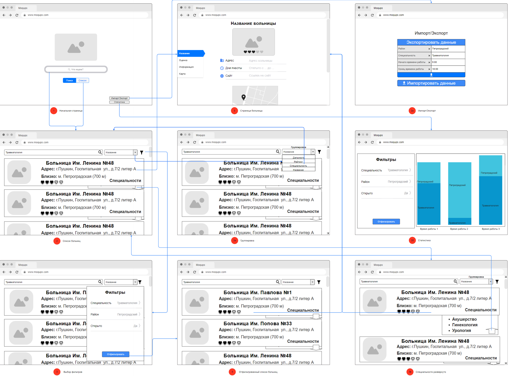

# ИС Справочник медицинских организаций (nosql2h22-med)
___
## Участники проекта.
+ Прашутинский Кирилл
+ Николаев Александр
___
## Скринкаст 'hello world'.
[📺📺📺📺📺 ](https://disk.yandex.ru/i/qXLKR7x_izH3jQ) <-- 'тык'

___
## Скринкаст прототипа.
[📺📺📺📺📺 ](https://disk.yandex.ru/i/guZ_C9hXcqiV9A) <-- 'тык'
___
## UX/UI-Дизайн Проекта.


## Работа с приложением

### Запуск приложения
```
docker-compose up --build
```

### Остановка приложения
```
docker-compose stop
```

### Запуск отдельного сервиса
- app - Сервис обмена данными между базой данных и сервисом front
- front - Сервис пользовательских функций и интерфейса  
```
docker-compose up --build app
```

### Остановка отдельного сервиса
```
docker-compose stop app
```
